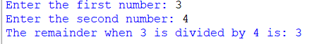

# Functions in Python: Modulo Calculator

## 🎯 Aim
To write a Python program that defines a function which accepts two values and returns their **modulo** using the `%` operator.

## 🧠 Algorithm
1. Define a function called `result` that takes two arguments `a` and `b`.
2. Inside the function, compute the modulo using `a % b`.
3. Print the result of the modulo operation.
4. Get two integer inputs from the user.
5. Call the `result` function with the user-provided values.

## 🧾 Program
```c
def modulo_calculator(a, b):
    """This function returns the remainder of a divided by b."""
    if b == 0:
        return "Error: Division by zero is not allowed."
    else:
        return a % b
num1 = int(input("Enter the first number: "))
num2 = int(input("Enter the second number: "))
result = modulo_calculator(num1, num2)
print("The remainder when", num1, "is divided by", num2, "is:", result)

```
## Output


## Result
Thus, the program has been executed successfully.
